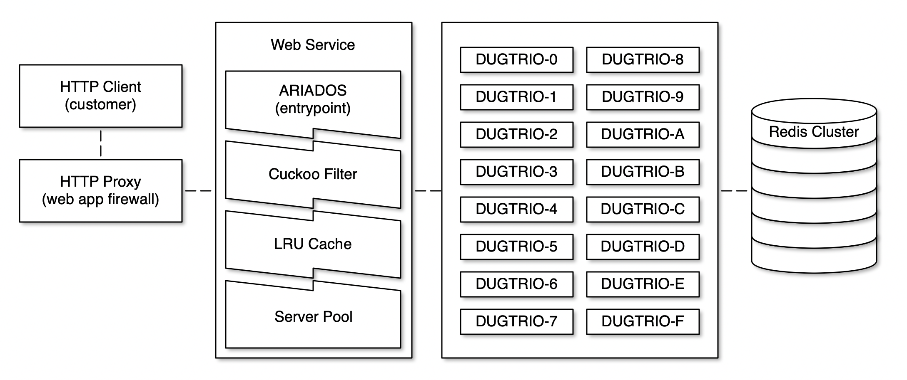

# BabyWAF (Rudimentary Web Application Firewall)

The following is a rudimentary implementation of an HTTP proxy with malware scan capabilities. The HTTP proxy is expected to load heavy loads of traffic and execute some operations against each request. If the request is found to be malicious by an internal web service the proxy returns an error to the client, otherwise the request is forwarded to the destination server.



## Workflow Safe URL

1. Client sends an HTTP request to download to `example.com/blog/hello-world`;
2. HTTP proxy takes the request and sends the URL for threat analysis to ARIADOS;
3. ARIADOS runs some basic checks on the URL before proceeding with the analysis;
4. URL is hashed using SHA256: `ca790f6428ecb8390cb8b6957c9c20c0a6ef0a259061135e8adcd05e68ad23b0`;
5. Check the URL-hash in the Cuckoo Filter, if not found then the URL is safe;
6. If the URL was found _(may be a false positive)_ then check if the URL-hash is in the LRU cache, if yes then return the Threat Info associated to it. **Note:** I didn’t invest time implementing this step, it is quite trivial to add LRU cache to the project, maybe later when I finish other things that are more relevant;
7. If the URL-hash is not in the LRU cache, then construct the URL for the server pool using the the first character of the hash sum, in this case `c` like this: `threat-info-{SERVERPREFIX}.Hostname`. Because the SHA256 sum is represented in hexadecimal, it means we will have at least sixteen (16) servers to lookup the threat info. If we configure the server to select two characters we will have a server pool of 256 servers. If select all sixty-four (64) characters we will have 115, 792, 089, 237, 316, 195, 423, 570, 985, 008, 687, 907, 853, 269, 984, 665, 640, 564, 039, 457, 584, 000, 000, 000, 000, 000 servers _(I don’t even know how to read this number LOL, that’s more than 1M at least)_;
8. `DUGTRIO-{SERVERPREFIX}` looks up the URL-hash on the persistent storage _(I am giving Redis as an example)_ and returns the Threat Info if available, otherwise returns `{Threat:NONE}` which means the URL appears to be safe.

## Updates

Use `POST /insert/THREAT_TYPE/URL` to insert unsafe URLs to the probabilistic data structure and the persistent storage.

## Deployment

Assumming you are familiar with [Docker](https://en.wikipedia.org/wiki/Docker_%28software%29) and [make](https://en.wikipedia.org/wiki/Makefile), the only thing you have to do is to open this directory and execute `make`. The Docker images will be created and the containers started. When everything is ready you can start playing.

## Cleanup

Executing `make clean` will stop and remove all the Docker containers and images.

## Unit-tests Tests

Only the main web service contains a couple of unit-tests:

```sh
cd ariados/ && go test -v ./...
```

## Integration Tests

```sh
# Terminal one (top screen)
docker-compose logs -f

# Terminal two (bottom screen)
make test-insert
make test-retrieve
```

## Research Notes: Initial Ideas

- Use a [Bloom Filter](https://en.wikipedia.org/wiki/Bloom_filter) to quickly determine if a URL is benign, in which case we can finish the operation fast, otherwise run the malware identifier against it;
- A [Cuckoo Filter](https://www.cs.cmu.edu/~dga/papers/cuckoo-conext2014.pdf) could be an option too. A cuckoo filter can also delete existing items, which is not supported by Bloom filters, and since infected URLs can be cleaned, it makes sense to offer the ability to remove them from the malware database;
- **Distributed Bloom/Cuckoo Filter?** Definitely possible, as long as the size and hash functions is the same in all the nodes. [Twitter effectively uses a Distributed Bloom Filter](https://twitter.github.io/algebird/datatypes/approx/bloom_filter.html) taking advantages of the monoid features of the data structure;
- LRU cache for the most common malicious URLs. Keep track of how many hits other malicious URLs get. Update the cache every few minutes with the list of URLs with more hits;
- Assume the proxy is internal which means implementing a rate limiter is not an option;
- Assume the HTTP proxy enforces URL encoding for the resource path and query parameters. Otherwise, the HTTP router in this webservice will ignore parts of the original URL and return a false positive;
- Worst case scenario is, every URL (including query params) is different and malicious;
- Because the query string is also taken in consideration, we may be able to split the malware check in subsets of the URL. For example, check if the hostname is blacklisted, check if the hostname+port is blacklisted, if not then proceed to check the entire URL against the malware database. We could use a Bloom Filter here as well for the hostname;
- Can we use HAProxy to manage a swarm of web services? This way we can distribute the load and offer high availability. However, this doesn’t help to address the memory consumption on each server;
- Google Safe Browsing API uses [gRPC Transcoding](https://github.com/googleapis/googleapis/blob/master/google/api/http.proto) syntax for communication. For the sake of simplicity, this web service will return a JSON encoded object with some information associated to the URL.

## Research Notes: Google Safe Browsing

After some thinking, I realized that this exercise is exactly what [Google Safe Browsing](https://en.wikipedia.org/wiki/Google_Safe_Browsing) is. They also use a Bloom Filter in Google Chrome to determine when to send a URL to the web service for a full scan or not. So I think implementing the algorithm in this exercise makes more sense now.

Some of the original engineers and managers in the Safe Browsing team _—led by Niels Provos—_ have already moved to other companies or teams inside Google:

- [Niels Provos](https://www.linkedin.com/in/nielsprovos/), Head of Security at Stripe
- [Panos Mavrommatis](https://www.linkedin.com/in/panayiotismavrommatis/), Security Engineering Director at Google
- [Moheeb Abu Rajab](https://www.linkedin.com/in/moheeb/), Principal Engineer at Google
- [Noé Lutz](https://www.linkedin.com/in/noelutz/), Engineering Lead at Google AI
- [Nav Jagpal](https://www.linkedin.com/in/nav-jagpal-3972152/), Senior Staff Engineer at Google
- [Allison Miller](https://www.linkedin.com/in/allisonmiller/), SVP Engineering at Bank of America
- [Fabrice Jaubert](https://www.linkedin.com/in/fabrice-jaubert-40a651/), Senior Software Development Manager at Google
- [Stephan Somogyi](https://www.linkedin.com/in/stephan-somogyi-54618a1/), Product Lead, Android Platform Security
- [Emily Schechter](https://www.linkedin.com/in/emilyschechter/), Product Manager at Google Chrome
- [Brian Ryner](https://www.linkedin.com/in/brian-ryner-b0b226133/), Software Engineer at Google
- [Lucas Ballard](https://www.linkedin.com/in/lucas-ballard-b577889b/), Senior Staff Software Engineer at Google
- [Ian Fette](https://www.linkedin.com/in/ianfette/), Senior Director Of Engineering at Slack

Nav Jagpal is the only one who is still involved in the project, so I went ahead and contacted him on LinkedIn to see if he could give me some ideas of how the web service works and the scale at which they are operating. I was recommended to take a look at the implementation code in these two projects:

- https://github.com/google/safebrowsing
- https://github.com/google/webrisk
